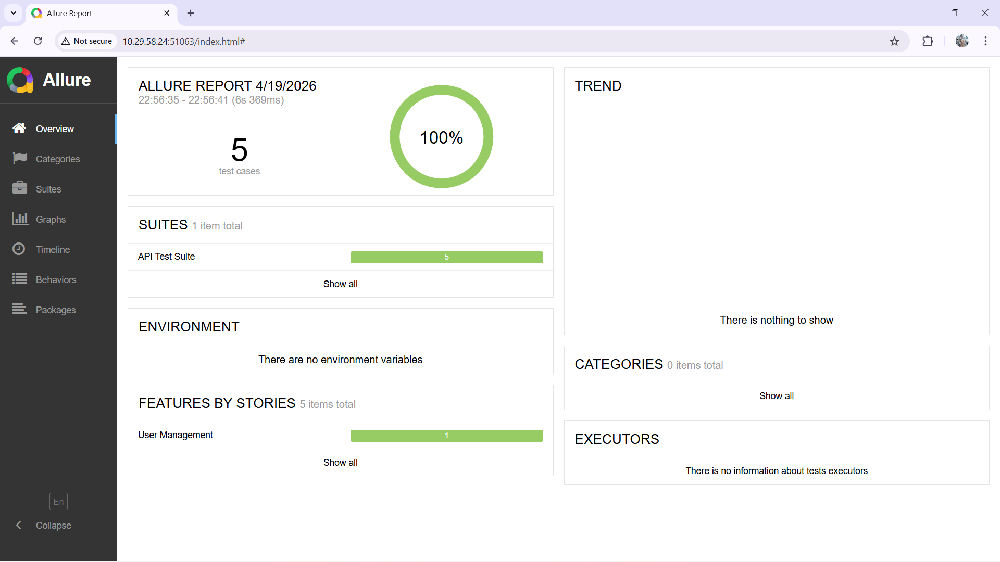

# 🌐 Phonebook API Automation (RestAssured)

A robust API testing framework designed for thorough validation of RESTful services. This project focuses on **Data Integrity** and advanced validation techniques beyond simple status-code checks.

## 🎯 Business Goal
To ensure the reliability and consistency of backend services, focusing on complex data flows, user management, and high-precision timestamp validation.

## 📊 Test Execution Report


## 🛠 Tech Stack


## 🏗 Architecture & Design Patterns
- **Data Integrity & Pagination**: Implemented a dynamic `while (hasMorePages)` loop to traverse multi-page API responses, aggregating all data for global validation. **Business logic validation includes cross-referencing multi-page data sets to ensure zero-loss information integrity.**
- **Trust Engineering (Time Validation)**: High-precision verification of `updatedAt` fields using **OffsetDateTime** and **ChronoUnit**. Ensures data sync accuracy within a 2-second margin.
- **POJO Serialization/Deserialization**: Seamless mapping of JSON payloads to Java Objects using **Lombok** `@Builder` for cleaner request/response handling.
- **Reusable Specifications**: Centralized `RequestSpecBuilder` and `ResponseSpecBuilder` in a `BaseTest` class to eliminate code duplication.
- **Reporting**: Advanced integration with **Allure Framework** for detailed step-by-step visibility of API interactions.

## 🚀 Getting Started
1. **Prerequisites**: JDK 11+ and Maven.
2. **Clone the repo**:
   ```bash
   git clone https://github.com/Alllmighty/Phonebook-API-Testing-REST.git
   ```
3. **Run Tests**:
   ```bash
   mvn clean test
   ```
4. **Generate Report**:
   ```bash
   allure serve allure-results
   ```